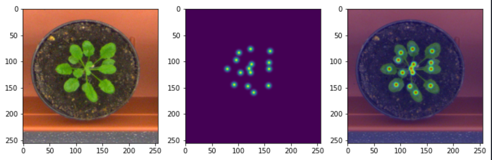

# DANN-Plant-Counting

## Reimplementation of Unsupervised Domain Adaptation For Plant Organ Counting (UDA4POC)

Re-implementation [Report](assets/Final_report_CVDL.pdf)

References:
Original implementation: https://github.com/p2irc/UDA4POC
Paper link: https://arxiv.org/abs/2009.01081

This project is a reproduction of the paper Unsupervised Domain Adaptation For Plant Organs Counting. The paper proposes a domain-adversarial learning approach for domain adaptation in object counting contexts levering the domain-adversarial neural network (DANN) framework.

## Training

### Datataset

- Download the CVPPP and Komatsuna Datasets:
  https://drive.google.com/drive/folders/1Huv7SBmLypiISoDFKWnZd_nd9w5EXYw8?usp=sharing
- Create a new `/data` folder
- Move the CVPPP pickle file to `/data/CVPPP` folder
- Move the Komatsuna pickle file to `/data/KOMATSUNA` folder

### Configurations

- The configurations for the trainer and the model are listed in the config.json file
- Default parameters: train for 30 epochs, monitor min validation loss for early stopping, saving every 2 epochs. Below is the list of configuration parameters:

```javascript
{
    "name": "Counting_Adapt",
    "n_gpu": 1,
    "UNET_ADAPT_arch": {
        "type": "CountAdapt",
        "args": {}
    },
    "data_loader_CVPPP": {
        "type": "CVPPP_DataLoader",
        "args": {
            "data_dir": "data/",
            "batch_size": 2,
            "shuffle": true,
            "validation_split": 0.1,
            "num_workers": 2
        }
    },
    "data_loader_KOMATSUNA": {
        "type": "KOMATSUNA_DataLoader",
        "args": {
            "data_dir": "data/",
            "batch_size": 2,
            "shuffle": true,
            "validation_split": 0.1,
            "num_workers": 2
        }
    },
    "optimizer_CVPPP": {
        "type": "Adam",
        "args": {
            "lr": 0.001,
            "weight_decay": 0,
            "amsgrad": true
        }
    },
    "density_loss": "mse_loss",
    "class_loss": "nll_loss",
    "domain_loss": "bce_loss",
    "metrics": [],
    "lr_scheduler": {
        "type": "StepLR",
        "args": {
            "step_size": 10,
            "gamma": 0.1
        }
    },
    "trainer": {
        "epochs": 30,
        "save_dir": "saved/",
        "save_period": 2,
        "verbosity": 2,
        "monitor": "min val_loss",
        "early_stop": 10,
        "tensorboard": true
    }
}
```

- Run the following command to start training

```
python3 train.py -c config.json
```

### Results

These are the results for the CVPPP to KOMATSUNA Adaptation:
| Adaptation Method | DiC | \|DiC\| | % | MSE |
|-------------------------------------|:-----:|:-------:|:-----:|:-----:|
| No Adaptation-from article | 4.09 | 4.09 | 0 | 18.49 |
| With Adaptation - Giuffrida, et al. | -0.78 | 1.04 | 26 | 1.84 |
| With Adaptation - from article | -0.95 | 1.56 | 29.33 | 5.26 |
| **With Adaptation - from code** | 0.69 | -0.07 | 16.67 | 5.13 |

This is a sample of training image and its dot labels:



## Acknowledgements:

The code structure of this repository follow the [PyTorch Template Project](https://github.com/victoresque/pytorch-template)
